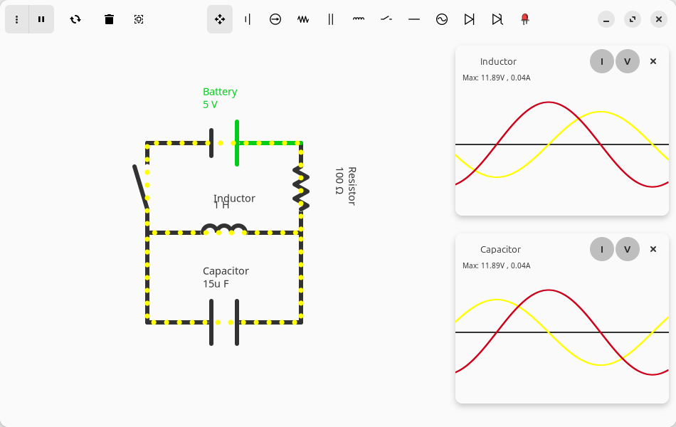
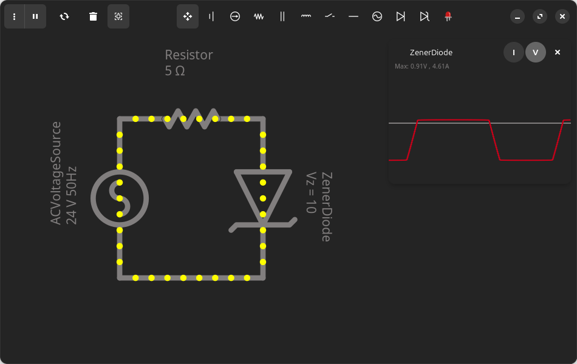

<a id="readme-top"></a>

<br />

<div align="center">
<a href="https://github.com/hamza-Algohary/Coulomb">
    
</a>
<h3 style="font-size:26px" align="center">Coulomb</h3>
<p align="center">
    A simple and beautiful circuit simulator app for Linux.
<br/> <br/>
</p>
</div>





## Features
- Draw arbitrary circuits
- Plot voltage and current of devices against time
- Save/Load circuits
- Dark Mode support
- Beautiful UI

## Available Devices
- Resistor
- Battery
- Current Source
- AC Voltage Source
- Inductor
- Capacitor
- Diode
- Zener Diode

## Problems
1. Circuits containing non-linear devices will most probably not be solvable, because the current backend is not good at dealing with non-linear systems, that's going to change though.
2. Due to the way inductors and capacitors are modeled you can't put two inductors in series, or two capacitors in parallel, that's also going to be fixed.
## Building From Source
1. Make sure [Gtk4](https://www.gtk.org/docs/installations/),  libadwaita and [Gradle](https://gradle.org/install/) are installed on your machine.
2. Clone this repo:
```
git clone https://github.com/hamza-Algohary/Coulomb
```
3. Navigate to project's folder
```
cd Coulomb
```
4. Build and run
```
./gradlew run
```
> [!NOTE]
> You can also build the flatpak package and run it:
> ```
> make
> make run
> ```

## Credits
- Coulomb's backend uses [Efficient Java Matrix Library](https://github.com/lessthanoptimal/ejml) for solving linear systems.
- Coulomb's logo is designed by Alhussien Algohary.
- Coulomb's behaviour is inspired by [Paul Falstad's Circuit Simulator](https://www.falstad.com/circuit/)


## License
Coulomb is released under the terms of the GNU General Public License v3
<!--## Acknowledgments-->
