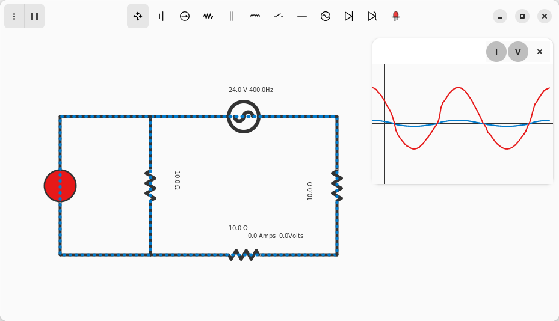

# Coulomb
Coulomb is a powerful and simple circuit simulator written with Java and Gtk4.
<br/><br/>

## Devices
- Battery
- Current Source
- Resistor
- Capacitor
- Inductor
- Switch
- AC Voltage Source
- Diode
- Zener Diode
- LED
## Installation & Usage
Clone this repo:
```
git clone https://github.com/hamza-Algohary/Coulomb/edit/main/README.md
```
Give executable permession:
```
chmod +x run.sh
```
Run the program:
```
./run.sh
```
