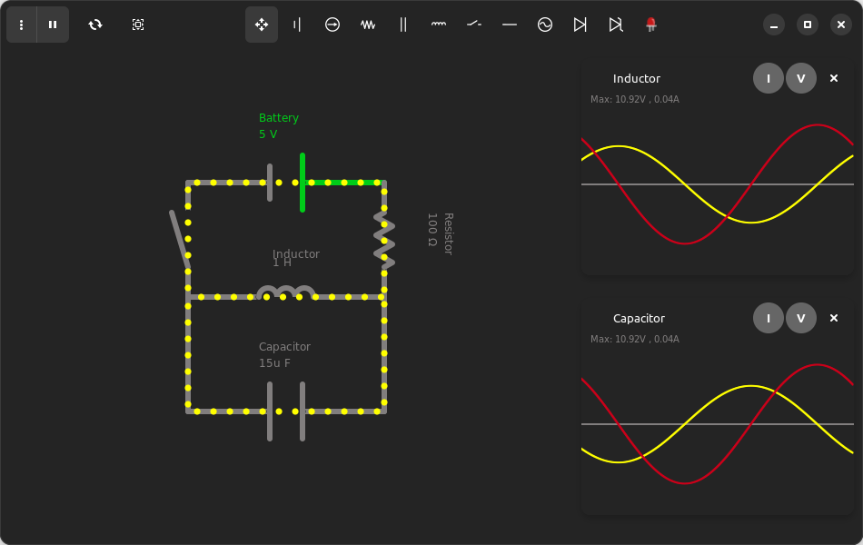

<a id="readme-top"></a>

<br />
<div align="center">
  <!--<a href="https://github.com/othneildrew/Best-README-Template">
    
  </a>-->

  <h3 align="center">Coulomb</h3>
  <p align="center">
    A powerful and beautiful cross-platform circuit simulator.
    <br />
  </p>
</div>





### Features
- Draw arbitrary circuits
- Plot voltage and current of devices against time
- Save/Load circuits
- Dark Mode support
- Beautiful UI using libadwaita

### Available Devices
- Resistor
- Battery
- Current Source
- AC Voltage Source
- Inductor
- Capacitor
- Diode
- Zener Diode

### Problems
1. Circuits containing non-linear devices will most probably not be solvable, because the current backend is not good at dealing with non-linear systems, that's going to change though.
2. Due to the way inductors and capacitors are modeled you can't put two inductors in series, or two capacitors in parallel, that's also going to be fixed.
### Building From Source
1. Make sure [Gtk4](https://www.gtk.org/docs/installations/),  libadwaita and [Gradle](https://gradle.org/install/) are installed on your machine.
2. Clone this repo:
```
git clone https://github.com/hamza-Algohary/Coulomb
```
3. Navigate to project's folder
```
cd Coulomb
```
4. Build and run
```
./gradlew run
```

## License
Distributed under the GPLv3 License.

<!--## Acknowledgments-->
